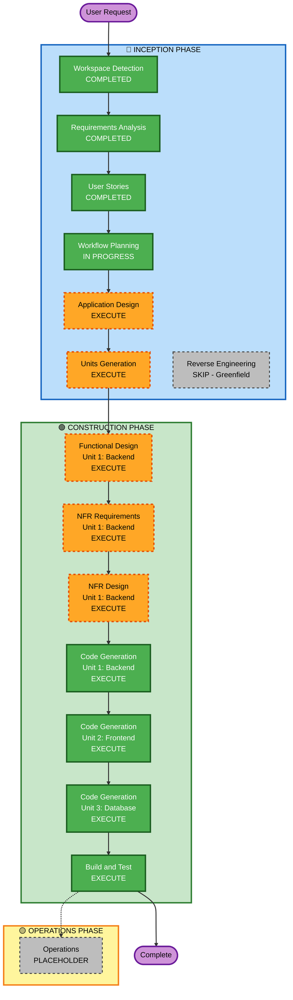

# Execution Plan
## Mess / Canteen Menu Voting System

---

## Detailed Analysis Summary

### Change Impact Assessment
| Area | Impact | Description |
|---|---|---|
| User-facing changes | Yes | Full student and admin UI with voting, results, feedback, dashboard |
| Structural changes | Yes | New full-stack system — Flask API + React SPA + MySQL |
| Data model changes | Yes | New schema: users, menus, menu_options, votes, feedback |
| API changes | Yes | New REST API with 15+ endpoints |
| NFR impact | Yes | Security (JWT, bcrypt, CORS, rate limiting), performance (connection pooling), scalability (500 users) |

### Risk Assessment
| Factor | Level |
|---|---|
| **Risk Level** | Medium |
| **Rollback Complexity** | Easy (greenfield — nothing to roll back to) |
| **Testing Complexity** | Moderate (voting uniqueness constraints, role-based access, deadline logic) |

---

## Workflow Visualization

---

## Phases to Execute

### 🔵 INCEPTION PHASE
- [x] Workspace Detection — COMPLETED
- [x] Reverse Engineering — SKIPPED (Greenfield project)
- [x] Requirements Analysis — COMPLETED
- [x] User Stories — COMPLETED (19 stories, 2 personas)
- [x] Workflow Planning — IN PROGRESS
- [ ] Application Design — **EXECUTE**
  - **Rationale**: New system with multiple components (API, SPA, DB). Component boundaries, service layer, and method signatures need definition before code generation.
- [ ] Units Generation — **EXECUTE**
  - **Rationale**: System decomposes into 3 distinct units (Backend, Frontend, Database) with different tech stacks and independent development paths.

### 🟢 CONSTRUCTION PHASE — Per-Unit Loop

#### Unit 1: Backend (Flask API)
- [ ] Functional Design — **EXECUTE**
  - **Rationale**: New data models (feedback table), complex business logic (vote change, deadline enforcement, weekly copy), and API contracts need detailed design.
- [ ] NFR Requirements — **EXECUTE**
  - **Rationale**: Security extension enabled; performance, rate limiting, logging, and CORS requirements need explicit NFR specification.
- [ ] NFR Design — **EXECUTE**
  - **Rationale**: NFR patterns (bcrypt, JWT, rate limiting, structured logging, security headers) need to be incorporated into the design.
- [ ] Infrastructure Design — SKIP
  - **Rationale**: Deployment target is a single VPS (not cloud-managed). No IaC or cloud resource mapping needed at this stage.
- [ ] Code Generation — **EXECUTE** (ALWAYS)

#### Unit 2: Frontend (React + Tailwind)
- [ ] Functional Design — SKIP
  - **Rationale**: Frontend is a consumer of the backend API. Component structure is straightforward; no complex business logic in the UI layer.
- [ ] NFR Requirements — SKIP
  - **Rationale**: Frontend NFRs (security headers, responsive design) are covered by the backend NFR design and Tailwind CSS.
- [ ] NFR Design — SKIP
  - **Rationale**: Same rationale as NFR Requirements for frontend.
- [ ] Infrastructure Design — SKIP
  - **Rationale**: Static hosting (Netlify/Vercel) — no IaC needed.
- [ ] Code Generation — **EXECUTE** (ALWAYS)

#### Unit 3: Database (MySQL Schema + Seed)
- [ ] Functional Design — SKIP
  - **Rationale**: Schema is fully defined in the Backend Functional Design.
- [ ] NFR Requirements — SKIP
  - **Rationale**: DB NFRs covered in Backend NFR design.
- [ ] NFR Design — SKIP
  - **Rationale**: Same as above.
- [ ] Infrastructure Design — SKIP
  - **Rationale**: Local MySQL for development; no cloud IaC needed.
- [ ] Code Generation — **EXECUTE** (ALWAYS)

### After All Units:
- [ ] Build and Test — **EXECUTE** (ALWAYS)

### 🟡 OPERATIONS PHASE
- [ ] Operations — PLACEHOLDER

---

## Success Criteria
- **Primary Goal**: Fully functional voting system with student and admin roles
- **Key Deliverables**: Flask API, React SPA, MySQL schema, seed data, build instructions
- **Quality Gates**:
  - All 15 SECURITY rules compliant or documented N/A
  - All 19 user stories have corresponding implementation
  - Unique vote constraint enforced at DB level
  - JWT auth working for all protected routes
  - Admin dashboard charts rendering with real data
